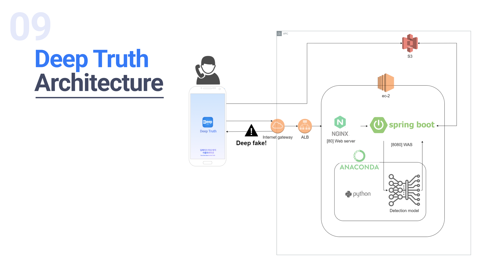

# Project Title

Deep Truth

## Getting Started

이 작업물은 2023 항공대학교 쏘-핫 해커톤 제출물 입니다. 

### Prerequisites

음성 및 영상을 detect하는 머신러닝 코드의 크기가 크므로 깃 상 관리가 어려울 수 있음.
따라서 작업은 서버 로컬에서 직접 진행하였으며, 이후 변경에 대한 오류의 책임을 지기 어려울 수 있음
머신러닝 코드가 본 스프링 서버와 같은 위치에 있어야 하며, 
application.yml의 path설정을 해준 이후에 작동이 가능

이외 audio, video의 path 설정 역시 해줘야 함

ml모듈 실행을 위한 conda env 설정이 필요함. 자세 사항은 ml git 참조

s3 연동을 위한 시크릿 필요

### Installing
conda env for ml module
path and local, extern variable;
logger config, aws s3 config

## Deployment

어플리케이션의 음성 및 비디오 파일 딥페이크 여부 detect 
&&
어플리케이션에서 나가는 음성 및 비디오 파일 딥페이크 악용 방지 서비스

## Built With

* [Gradle](https://gradle.org/) - Dependency Management
* [Swagger](https://swagger.io/) - Spring docs

## Authors

* **정민석** - *Initial work* - [JamesDev51](https://github.com/JamesDev51)
* **이석잔** - *developer* - [2sssg](https://github.com/2sssg)

## Architecture

